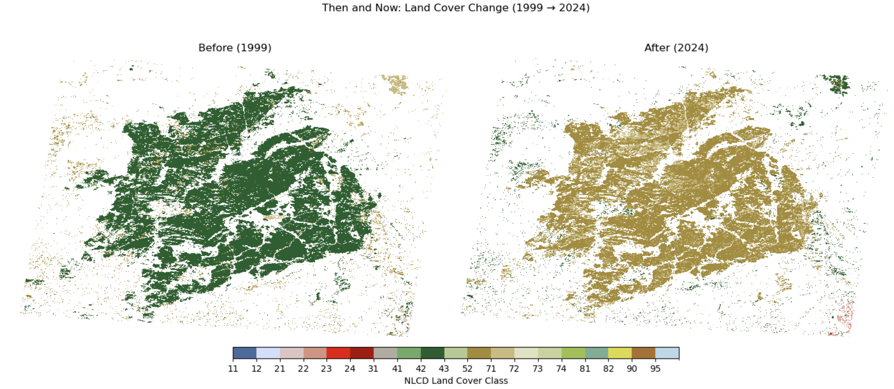
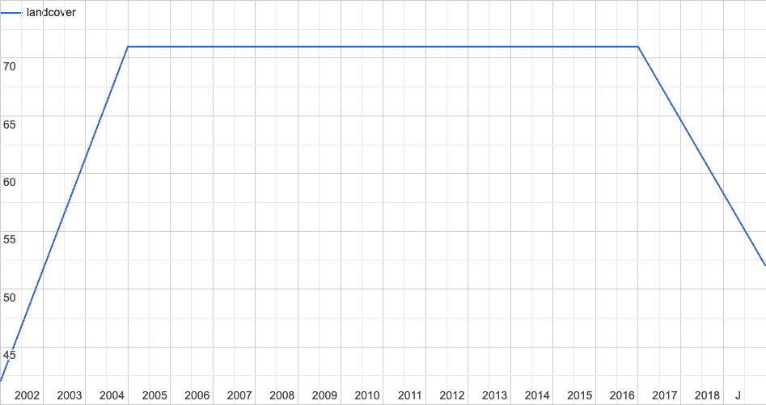
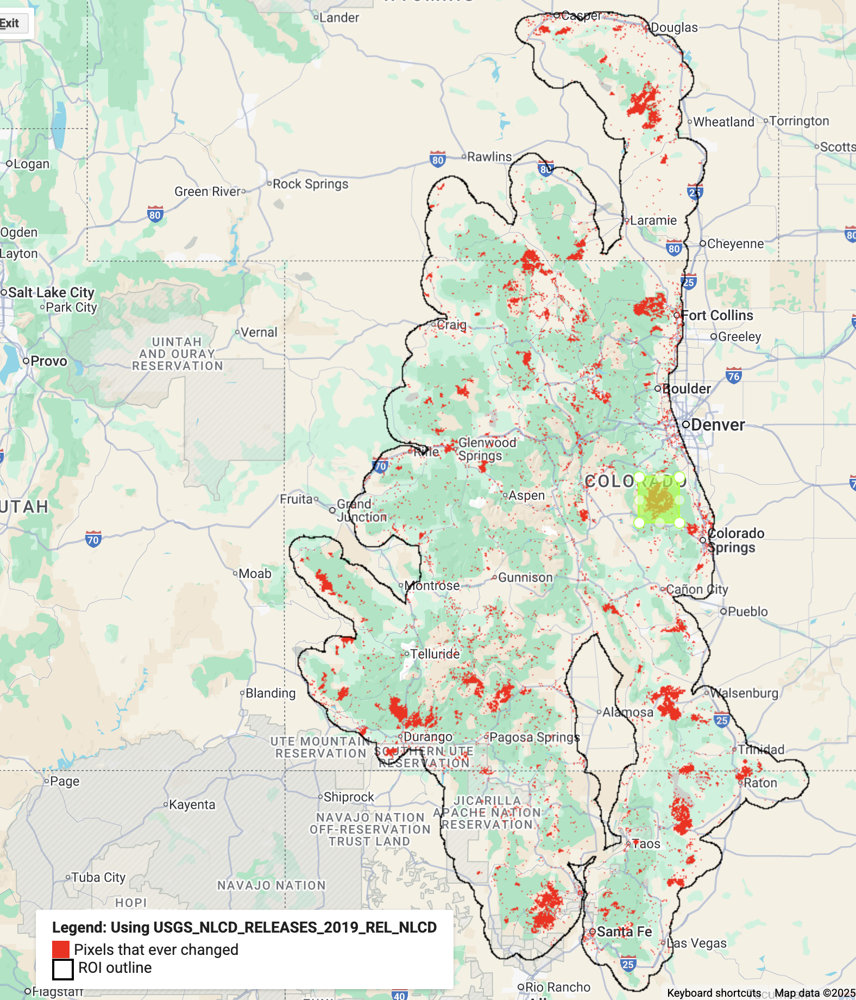
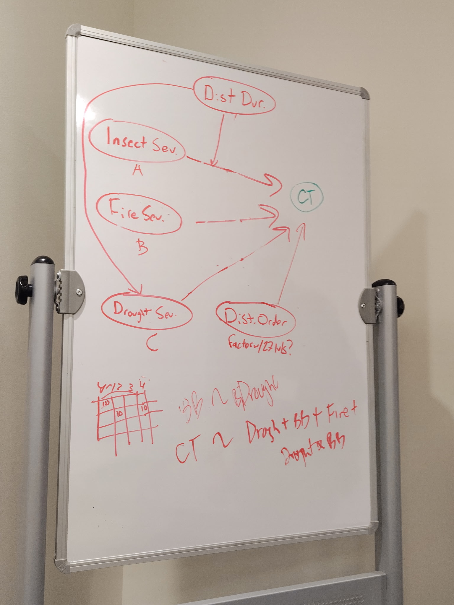
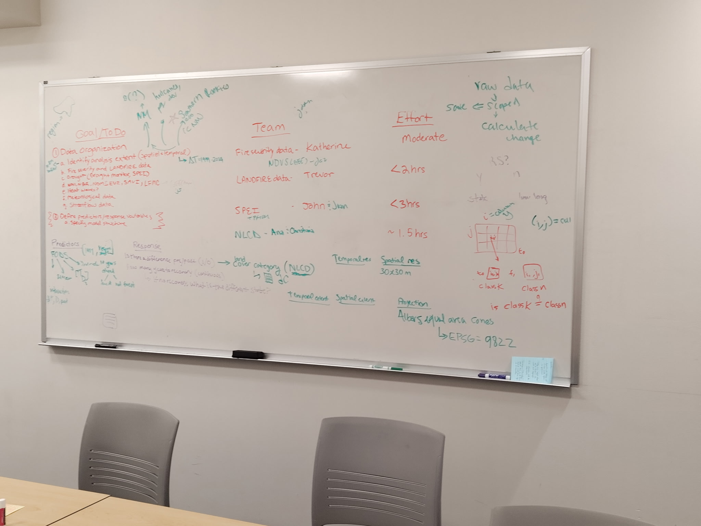

# Stressors: Order, Duration, Frequency & Intensity — Innovation Summit 2025 (Group 2)

<a href="https://github.com/CU-ESIIL/stressors-order-duration-frequency-intensity-innovation-summit-2025__2/edit/main/docs/index.md" title="Edit this page">✏️</a>

<!-- =========================================================
HERO (Swap hero.jpg, title, strapline, and the three links)
========================================================= -->

**One sentence on impact:** In 3 days we will determine a workflow to evaluate how the order, duration, frequency, and intensity of disturbances affect the likelihood of regime shifts from forests to nonforests.

[View shared code](https://github.com/CU-ESIIL/stressors-order-duration-frequency-intensity-innovation-summit-2025__2/blob/main/code/prism_quicklook.py) · [Data & access](https://github.com/CU-ESIIL/stressors-order-duration-frequency-intensity-innovation-summit-2025__2/blob/main/code/prism_quicklook.py)**

> **About this site:** This public log captures our Innovation Summit sprint. Update it directly in GitHub (open a file → ✏️ → Commit changes) so the homepage always reflects the latest thinking.

---

## How to use this page (for the team)
- **Edit this file:** `docs/index.md` → ✎ → change text → **Commit changes**.
- **Add images:** upload to `docs/assets/` and reference like `assets/your_file.png`.
- Keep **text short** and **visuals first**. Think “slide captions,” not essays.

---

## Day 1 — Define & Explore
*Focus: questions, hypotheses, context; add at least one visual (photo of whiteboard/notes).*

### Our product(s) 📣
- **Short term**: 
  - Identify our response!
  - Two graphs illustrating the effects of disturbance
  - Code for processing datasets to 1) identify tipping points from the datasets, and 2) calculate disturbacne severity, order, frequency, duration (SOFD)from datasets.
  - Graph of Landfire filtered vegetaiton or region of choice
- **Long term**: 
  - Paper! Providing a case study of tipping point drivers in one sample system (forests?)
  - Grant proposal!

### Our question(s) 📣
- How does the FODS of fire, drought, and development stressors influence ecosystem recovery windows?
- Where do short, intense stress clusters lead to the greatest community or ecological vulnerability?
- LT Who needs this information first (agency partners, community groups, funders) to take action?

### Hypotheses / intentions [Optional: probably not relevant if you are creating an educational tool]
- We think that the spacing between stressors is as important as their intensity for predicting recovery needs.
- We intend to test whether compact clusters of high-intensity events correlate with regime shifts? .

### Why this matters (the “upshot”) 📣
Colorado resource managers need fast, visual explanations of how multiple stressors overlap. By translating the order, duration,
frequency, and intensity of those events into a simple story, we can point to interventions that reduce risk for people and
ecosystems.

### Field notes / visuals
<!-- EDIT: Replace with a real smartphone photo or sketch; keep filename simple. -->

[Raw photo location: day1_whiteboard.jpg](assets/day1_whiteboard.jpg)
*Caption: Day 1 brainstorm.*

[Raw photo location: day1_norms.jpg](assets/day1_norms.jpg)
*Caption: Caption: Day 1 norms.*

> **Different perspectives:** Briefly capture disagreements or alternate framings. These can unlock innovation.
[emergency management triggers]
> - We will know we’re onto something if we can visualize at least two contrasting stressor sequences with clear decision cues.
---

## Day 2 — Data & Methods
*Focus: what we’re testing and building; show a first visual (plot/map/screenshot/GIF).*

**Study Area: Southern Rockies Ecoregion**   
Spatial extent: a small part of the ecoregion  
Spatial resolution: 30x30m  
Temporal extent: 1999-2024  
Temporal resolution: Annual  
Projection: Albers Equal Area Conic projection (EPSG 9822)

**Response Variables**
1. Was there a regime shift? (Change from forest to nonforest that did not recover within 10 years)
2. If there WAS NOT a regime shift, how long did forests take to recover? 
3. If there WAS a regime shift, what system did the forest transition to? (e.g. grassland, shrubs) 

**Questions:**
- How does the FODS of fire, drought, insects, and their interaction influence forest shifts to non-forest between 1999 and 2024 in the Southern Rockies ecoregion?
- How does the FODS of fire, drought,  insects, and their interaction influence forest recovery between 1999 and 2024 in the Southern Rockies ecoregion?

### Data sources we’re exploring 📣
<!-- EDIT: Link each source; add size/notes if relevant. -->
 *Snapshot showing initial data patterns.*

Predictors: Frequency, order, duration, severity of   
A) Fire, insect outbreaks from LANDFIRE  
B) Drought measured as SPEI from PRISM  
C) Fire severity from MTBS  
  
### Methods / technologies we’re testing 📣
- Approach 1 - generalized linear (mixed) models with a binomial response
- Approach 2 - generalized linear (mixed) model with a continuous response
- Visualization (e.g., map tiles, small multiples)

  
### Challenges identified
- We speak different languages - coding, disciplines, chosen technologies
- Gaps in the data
- Computational constraints - working with big data is hard!
- Ensuring models accurately represent our understanding of the system (DAGS)
- Scaling up
- Identifying final predictors (How do we calculate FODS for each disturbance)
- Defining regime shift (Is 10 years long enough?) Need theoretical frameworks!
  

### Visuals
<!-- EDIT: Swap examples; keep file sizes modest. -->
#### Study Area Subset

*Figure 1.* Area containing the Hayman Fire showing changes in land cover from 1999 to 2024.

#### Pixel State Change for Hayman Fire Area (Using NLCD 2019)

*Figure 2.* Plot of land cover change for a pixel in chosen area.

#### Interactive map

[ESIIL 2025 Earth Engine App](https://ee-anatarano.projects.earthengine.app/view/esiil2025)

#### DAG

*Figure 3.* Initial DAG.

#### Thought process day 2

*Figure 4.* Datasets, response, workflow.

  
### **Next steps:**   
**Short term**  
Continue processing the data to arrive at final responses and predictors  
Refine the DAG  
Run models   
Scale to Southern Rockies/USA
**Moderate term**  
Submit a WG proposal with Group 3  
Include more disturbances
Write up our results and submit as a manuscript  
**Long term**   
Submit a grant proposal with Group 3   

---

## Final Share Out — Insights & Sharing 
*Focus: synthesis; highlight 2–3 visuals that tell the story; keep text crisp. Practice a 2-minute walkthrough of the homepage 📣: Why → Questions → Data/Methods → Findings → Next.*

[Raw photo location: team_photo.jpg](https://github.com/CU-ESIIL/stressors-order-duration-frequency-intensity-innovation-summit-2025__2/blob/main/docs/assets/team_photo.jpg)

### Findings at a glance 📣
<!-- EDIT: 2–4 bullets, each a headline in plain language with a number if possible. -->
- Headline 1 — what, where, how much
- Headline 2 — change/trend/contrast
- Headline 3 — implication for practice or policy

### Visuals that tell the story 📣
<!-- EDIT: Swap visuals; prioritize clarity. -->

[Raw photo location: fire_hull.png](https://github.com/CU-ESIIL/stressors-order-duration-frequency-intensity-innovation-summit-2025__2/blob/main/docs/assets/fire_hull.png)
*Visual 1.* Swap in the primary graphic that clearly communicates your core takeaway.

[Raw photo location: hull_panels.png](https://github.com/CU-ESIIL/stressors-order-duration-frequency-intensity-innovation-summit-2025__2/blob/main/docs/assets/hull_panels.png)
*Visual 2.* Use a complementary panel, collage, or set of snapshots that reinforces supporting evidence.

[Raw photo location: main_result.png](https://github.com/CU-ESIIL/stressors-order-duration-frequency-intensity-innovation-summit-2025__2/blob/main/docs/assets/main_result.png)
*Visual 3.* Highlight an additional visual that captures a secondary insight or next step.

<iframe
  title="Short explainer video (optional)"
  width="100%" height="360"
  src="https://www.youtube.com/embed/ASTGFZ0d6Ps"
  frameborder="0" allow="accelerometer; autoplay; clipboard-write; encrypted-media; gyroscope; picture-in-picture; web-share"
  allowfullscreen></iframe>

### What’s next? 📣
- Immediate follow-ups
- What we would do with one more week/month
- Who should see this next

---

## Featured links (image buttons)
<!-- EDIT: Replace images/links; keep alt text meaningful and motion subtle. -->
<table>
<tr>
<td align="center" width="33%">
  <a href="assets/Seven%20ways%20to%20measure%20fire%20polygon%20velocity-4.pdfa"> <strong>Read the brief</strong></a>
</td>
<td align="center" width="33%">
  <a href="https://github.com/CU-ESIIL/stressors-order-duration-frequency-intensity-innovation-summit-2025__2/blob/main/code/prism_quicklook.py"> <strong>View code</strong></a>
</td>
<td align="center" width="33%">
  <a href="https://github.com/CU-ESIIL/stressors-order-duration-frequency-intensity-innovation-summit-2025__2/blob/main/code/prism_quicklook.py"> <strong>Explore data</strong></a>
</td>
</tr>
</table>

---

## Team
| Name | Role | Contact | GitHub |
|------|------|---------|--------|
| Jane Doe | Lead | jane.doe@example.org | @janedoe |
| John Smith | Analyst | john.smith@example.org | @jsmith |

---

## Storage

Code
Keep shared scripts, notebooks, and utilities in the [`code/`](https://github.com/CU-ESIIL/stressors-order-duration-frequency-intensity-innovation-summit-2025__2/tree/main/code) directory. Document how to run them in a README or within the files so teammates and visitors can reproduce your workflow.

Documentation
Use the [`docs/`](https://github.com/CU-ESIIL/stressors-order-duration-frequency-intensity-innovation-summit-2025__2/tree/main/docs) folder to publish project updates on this site. Longer internal notes can live in [`documentation/`](https://github.com/CU-ESIIL/stressors-order-duration-frequency-intensity-innovation-summit-2025__2/tree/main/documentation); summarize key takeaways here so the public story stays current.

---

## Cite & reuse
If you use these materials, please cite:

> Innovation Summit 2025 Group 2 Team. (2025). *Stressors: Order, Duration, Frequency & Intensity — Innovation Summit 2025 (Group 2).* https://github.com/CU-ESIIL/stressors-order-duration-frequency-intensity-innovation-summit-2025__2

License: CC-BY-4.0 unless noted. See dataset licenses on the **[Data](data.md)** page.

---

### Challenges identified/NA
- Aligning spatial footprints between hydrologic gauges, fire perimeters, and community boundaries.
- Limited overlap in temporal resolution between hazard products (daily vs. sub-daily events).
- Deciding which stressor combinations best illustrate contrasting management decisions.

### Methods / technologies we’re testing 📣 /NA
- Sequence analysis of multi-hazard timelines (fire → drought → flood).
- Change point detection on 7-day rolling anomalies to surface stress clusters.
- Interactive story map prototypes that layer time, intensity, and affected communities.

<!-- EDIT HINTS
- Upload images to docs/assets/ and reference as assets/filename.png
- Keep images ~1200 px wide; avoid >5–8 MB per file.
- Use short, active sentences; this is a scrolling “slide deck.”
- Update this page at least once per day during the sprint.
-->
